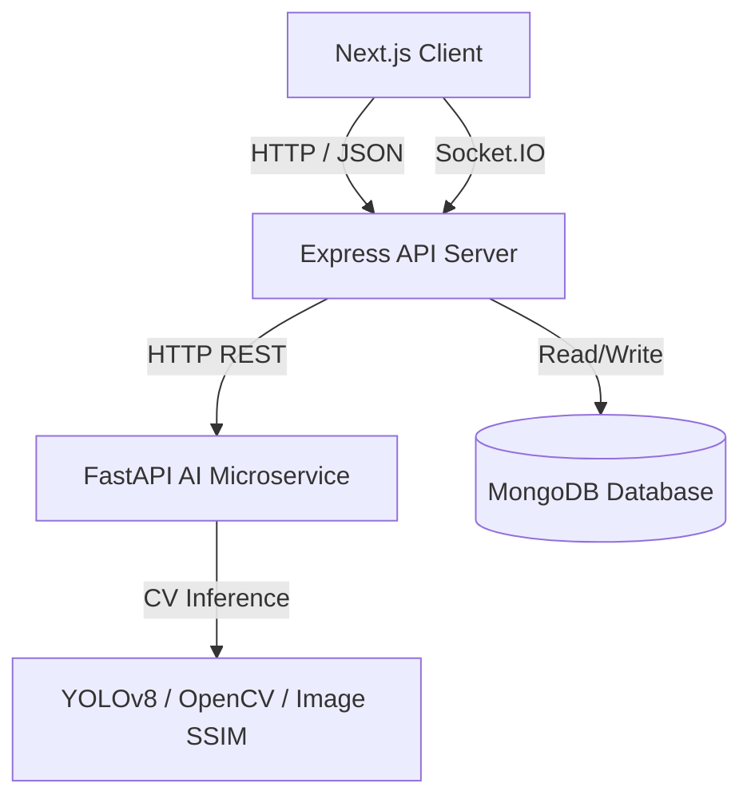

# Community Hero AI – Hyperlocal Civic Problem Solver
> **Tagline**: *“Empowering Communities Through AI-Driven Civic Action.”*

Community Hero AI is a next-generation smart-city civic engagement platform that allows citizens to report, verify, track, and resolve local infrastructure hazards (e.g. potholes, broken streetlights, sewage leaks) using computer vision, real-time WebSockets, interactive heatmaps, and a gamified reputation ecosystem.

---

## 1. Complete System Architecture
The platform is organized as a monorepo consisting of three primary services:
* **Next.js Client (Frontend)**: Standard React 18 frontend employing Tailwind CSS, Zustand, Framer Motion, and Leaflet Maps.
* **Express Gateway (Backend)**: Node.js API server coordinating transactions, JWT authentication, and real-time Socket.IO notification push.
* **FastAPI Service (AI Engine)**: Python microservice running computer vision inference (YOLOv8 + OpenCV) and keyword-based NLP priority engine.



---

## 2. Monorepo Folder Structure
```
community-hero-ai/
├── backend/                  # Node.js + Express + Socket.IO Server
│   ├── config/               # Database and Env configurations
│   ├── controllers/          # Business logic controllers
│   ├── middleware/           # Auth, RBAC, Validation, Error Handling
│   ├── models/               # MongoDB models (User, Complaint, Comment, Notification)
│   ├── routes/               # Express routing endpoints
│   ├── sockets/              # Socket.io connection events
│   ├── package.json
│   └── server.js
├── frontend/                 # Next.js App Router Client
│   ├── app/                  # Route layouts and dashboard panels
│   ├── components/           # Navbar, LeafletMap, UI panels
│   ├── store/                # Zustand global states (auth, complaints)
│   ├── tailwind.config.js
│   └── package.json
├── ai-service/               # FastAPI AI & CV Microservice
│   ├── app/
│   │   ├── api/              # Endpoints (detect, verify-resolution)
│   │   └── main.py           # Python server entrypoint
│   ├── requirements.txt
│   └── Dockerfile
├── shared/                   # Config constraints and shared constants
├── docker-compose.yml        # Multi-service local execution
└── README.md                 # Complete platform blueprint
```

---

## 3. Frontend Architecture
Built on Next.js 14 App Router:
* **UI Components**: Modern dark/light glassmorphic card tiles, responsive navigation bars, and slide-in panels.
* **State Management (Zustand)**: Single-store managing token sessions, active GPS locations, recent lists, and hero points.
* **Maps (Leaflet)**: Dynamically rendered Leaflet maps displaying custom pin overlays colored by severity.
* **Animations (Framer Motion)**: Dynamic modal entrances, hover-states, and loading indicator pulses.

---

## 4. Backend Architecture
Built on Node.js/Express.js:
* **Server Setup (`server.js`)**: Configures CORS policies, routes uploads, establishes MongoDB connections, and initializes Socket.IO.
* **Geo-Indexing**: Integrates MongoDB `2dsphere` index to support nearby radius queries (`$near` lookup within 5km).
* **AI API Gateway Client**: Forwards submitted pictures to the FastAPI endpoint, handles timeouts, and implements custom mock fallbacks if the AI microservice fails.

---

## 5. AI Microservice Architecture
Built on Python FastAPI:
* **Object Detection (`/detect`)**: Passes input through YOLOv8 to locate potholes, trash bags, or structural damage.
* **NLP Priority Guard**: Parses description text keywords (e.g. "accident", "school zone", "hospital") to elevate priority from standard to *Critical*.
* **Before/After Verification (`/verify-resolution`)**: Converts pre-resolution and post-resolution images to grayscale, sizes them to 256x256, and computes OpenCV structural differences (SSIM) to check if the repair is completed.

---

## 6. Database Schema (MongoDB Mongoose)

### User Collection
```javascript
{
  name: { type: String, required: true },
  email: { type: String, required: true, unique: true },
  password: { type: String, required: true },
  role: { type: String, enum: ['citizen', 'authority', 'admin'], default: 'citizen' },
  heroPoints: { type: Number, default: 0 },
  badges: [{ title: String, description: String, awardedAt: Date }],
  reportsSubmitted: { type: Number, default: 0 }
}
```

### Complaint Collection
```javascript
{
  issueType: { type: String, required: true },
  description: { type: String },
  imageUrl: { type: String, required: true },
  location: {
    type: { type: String, default: 'Point' },
    coordinates: [Number] // [longitude, latitude]
  },
  severity: { type: String, enum: ['Low', 'Medium', 'High', 'Critical'], default: 'Medium' },
  status: { type: String, enum: ['Reported', 'Verified', 'In Progress', 'Resolved'], default: 'Reported' },
  verificationCount: { type: Number, default: 0 },
  upvotes: [{ type: Schema.Types.ObjectId, ref: 'User' }],
  verifiedBy: [{ type: Schema.Types.ObjectId, ref: 'User' }],
  createdBy: { type: Schema.Types.ObjectId, ref: 'User', required: true },
  assignedDepartment: { type: String, default: 'Unassigned' },
  resolvedImageUrl: { type: String },
  aiAnalysis: { confidence: Number, summary: String, detectedObjects: [String], beforeAfterScore: Number }
}
```

* **Index Optimization**: `location: "2dsphere"` index for rapid geolookups, and compound index on `{ status: 1, severity: -1 }` for priority queue retrieval.

---

## 7. REST API Structure
| Endpoint | Method | Auth | Description |
|---|---|---|---|
| `/api/auth/signup` | POST | Public | Register new user accounts |
| `/api/auth/login` | POST | Public | Log in and receive JWT token |
| `/api/complaints` | POST | JWT | Upload complaint image, desc, coordinates |
| `/api/complaints` | GET | Public | Fetch complaints list (filters: lat, lng, radius) |
| `/api/complaints/:id` | GET | Public | Fetch complaint detail and comments |
| `/api/complaints/:id/verify`| POST | JWT | Community validation upvote (+5 points) |
| `/api/complaints/:id/status`| PUT | JWT (Auth) | Update task status (Reported -> In Progress -> Resolved) |
| `/api/analytics/heatmap` | GET | Public | Get coordinate logs for density overlay |
| `/api/rewards/leaderboard` | GET | Public | Get top 10 users ranked by points |

---

## 8. Authentication Flow
```
[Client SignUp/Login] ──> [Bcrypt Hash Validation] ──> [Generate JWT (expires 7d)]
        ▲
        │ (JWT in Authorization Header)
[Access Protected Routes] ──> [JWT Verify Middleware] ──> [Role Check Guard (RBAC)]
```

---

## 9. UI/UX Workflow
* **Citizen Flow**:
  1. Open Citizen Dashboard -> view local Map and active pins.
  2. Click "Report Issue" -> upload photograph.
  3. AI updates prediction panel (Category, Confidences, Priority) instantly.
  4. Submit -> Receive +15 Hero Points (congratulations confetti).
* **Authority Flow**:
  1. Open Authority Dashboard -> view urgent issues queue.
  2. Assign task to department (e.g. Public Works) and update status to "In Progress".
  3. Upload repair completion photograph -> AI evaluates Before/After SSIM match.
  4. Resolve -> User notified, points credited to reporter (+50 points).

---

## 10. Deployment Workflow
* **Local Execution (Docker Compose)**: Set up Node backend, FastAPI, and MongoDB in containers locally using `docker-compose up`.
* **CI/CD Workflow (GitHub Actions)**: Automated testing suites on push to master, and automatic deployment pipeline:
  - Frontend: Vercel serverless.
  - Backend API: Render/Railway web application container.
  - AI Service: Render web service container (running Dockerfile).
  - Database: MongoDB Atlas cloud cluster.

---

## 11. Detailed Development Roadmap
* **Phase 1: Foundation (Days 1-2)**: Scaffold monorepo packages, Mongoose schemas, and FastAPI template with YOLO mock fallback logic.
* **Phase 2: Next.js Client & Maps (Days 3-4)**: Draft landing portals, integrate Leaflet Map centers, build report modal, and visual AI terminal.
* **Phase 3: Sockets & Authority Panel (Days 5-6)**: Establish real-time Socket.IO listeners, authority task board, and upload verification widgets.
* **Phase 4: Gamification & Polishing (Day 7)**: Integrate Canvas-Confetti, point multipliers, leaderboards, and write test runs.

---

## 12. MVP Feature List
* Role-based signup and login (JWT).
* Reporting form with photo uploads, GPS detection, and AI response panel.
* Dynamic Leaflet Map with status pins.
* Upvoting community verification mechanics.
* Authority prioritization queue and status controls.

## 13. Advanced Feature List
* **Before/After AI Verification**: SSIM comparing.
* **Real-time Map sync**: Live pin insertion on reporting.
* **Gamified Hero Badges**: Rank tiers on points achievements.
* **SOS Escalation**: Critical hazard bypass directly routing to emergency responses.
* **Offline sync**: LocalStorage buffers complaints if network connection fails, syncing automatically when connection returns.

---

## 14. GitHub Repository Structure
* Git repositories should separate packages neatly:
  - `/frontend` for Next.js workspace.
  - `/backend` for Express gateway.
  - `/ai-service` for Python API.
  - `/shared` for shared validation constants.
  - `.github/workflows/ci-cd.yml` for automated pipelines.

---

## 15. Setup & Running Instructions

### Local Configuration (Traditional)
1. **Start Backend**:
   ```bash
   cd backend
   npm install
   npm run dev
   ```
2. **Start FastAPI Service**:
   ```bash
   cd ai-service
   pip install -r requirements.txt
   python app/main.py
   ```
3. **Start Frontend**:
   ```bash
   cd frontend
   npm install
   npm run dev
   ```

### Local Configuration (Docker Compose)
Simply run the following command at the root directory:
```bash
docker-compose up --build
```
Open `http://localhost:3000` to access the application.

---

## 16. Environment Variables Structure
Create a `.env` file in the `/backend` folder:
```env
PORT=5000
MONGO_URI=mongodb://localhost:27017/community_hero
JWT_SECRET=supersecret_hackathon_key
AI_SERVICE_URL=http://localhost:8000
```

Create a `.env` in the `/ai-service` folder:
```env
PORT=8000
HOST=0.0.0.0
```

---

## 17. Recommended NPM Packages
* **Express & Mongoose**: Primary web API framework and ODM for MongoDB.
* **Socket.io**: Real-time duplex communication between client and server.
* **Framer-motion**: Fluid layout animations.
* **Zustand**: Fast, lightweight react global state manager.
* **Leaflet**: Mobile-friendly interactive mapping.

## 18. Recommended Python Libraries
* **FastAPI & Uvicorn**: Async Python web framework.
* **Ultralytics**: Object detection using pretrained/custom YOLOv8 weights.
* **OpenCV (opencv-python-headless)**: Image scaling and grayscale preprocessing for similarity scoring.
* **Pydantic**: Data validation and type settings.

---

## 19. Testing Strategy
* **Backend API (Jest)**: Integration tests verifying JWT token generation, routing controllers, and Mongoose operations.
* **AI Service (Pytest)**: API endpoints tests sending mockup image links to verify response objects format.
* **End-To-End (Cypress)**: Simulating the core workflow (report filing, map pins matching, upvote checks, resolution verification).

---

## 20. Future Scalability Plan
* **Redis Caching & Pub/Sub**: Move real-time updates from in-memory Socket.io to a Redis-backed message broker to support horizontally scaled backend instances.
* **AWS S3 / CDN Cloudfront**: Store image files on CDN locations close to user coordinates to optimize loading speeds.
* **Serverless Inference (AWS Lambda / SageMaker)**: Delegate the YOLOv8 GPU inference models to serverless containers to keep python services lightweight and responsive under heavy loads.
